[](https://github.com/yourusername/yourdaddy-assistant/actions/workflows/ci.yml)
[](https://www.python.org/downloads/)
[](https://opensource.org/licenses/MIT)
[](https://www.microsoft.com/windows)
[](https://github.com/psf/black)

# 🤖 YourDaddy AI Assistant

<div align="center">

**A sophisticated AI-powered personal assistant with voice recognition, smart automation, and multilingual support**

[🚀 Quick Start](#-quick-start) • 
[📖 Documentation](#-documentation) • 
[🤝 Contributing](#-contributing) • 
[💬 Community](#-community) • 
[📊 Project Status](#-project-status)

</div>

---

## 🌟 Key Features

<table>
<tr>
<td width="50%">

### 🧠 **AI-Powered Intelligence**
- **Google Gemini 2.0**: Latest AI models with vision support
- **Multimodal Processing**: Text, voice, image, and document analysis
- **Contextual Memory**: Remembers conversations and user preferences
- **Smart Automation**: Intelligent task automation and scheduling

</td>
<td width="50%">

### 🗣️ **Advanced Voice System**
- **Wake Word Detection**: "Hey Daddy" activation
- **Multilingual Support**: English, Hindi, and Hinglish
- **Offline Recognition**: Vosk-powered local processing
- **Neural TTS**: Natural-sounding speech synthesis

</td>
</tr>
<tr>
<td width="50%">

### 🌐 **Modern Web Interface**
- **Real-time Chat**: WebSocket-powered messaging
- **Responsive Design**: Works on all devices
- **Voice Web Commands**: Browser-based voice interaction
- **Dark/Light Themes**: Customizable appearance

</td>
<td width="50%">

### 🎵 **Entertainment Integration**
- **Spotify Control**: Full music library control
- **YouTube Music**: Seamless playlist management
- **Smart Recommendations**: AI-powered music suggestions
- **Voice Commands**: "Play my favorite songs"

</td>
</tr>
</table>

## 🚀 Quick Start

### Prerequisites
- **Python 3.8+** 
- **Windows 10/11** (for full features)
- **Google Gemini API Key** ([Get yours here](https://makersuite.google.com/))

### Installation

1. **Clone the repository**
   ```bash
   git clone https://github.com/yourusername/yourdaddy-assistant.git
   cd yourdaddy-assistant
   ```

2. **Create virtual environment**
   ```bash
   python -m venv venv
   venv\Scripts\activate  # Windows
   # source venv/bin/activate  # Linux/Mac
   ```

3. **Install dependencies**
   ```bash
   pip install -r requirements.txt
   ```

4. **Configure environment**
   ```bash
   copy .env.example .env
   # Edit .env with your API keys
   ```

5. **Launch the assistant**
   ```bash
   python yourdaddy_app.py
   ```

### 🎯 First Steps

1. **Configure your API key** in `.env` file
2. **Test voice recognition**: Say "Hey Daddy"
3. **Try web interface**: Visit `http://localhost:5000`
4. **Explore features**: Check the modules directory

## 📖 Documentation

<div align="center">

| **Guide** | **Description** | **Link** |
|-----------|-----------------|----------|
| 🚀 **Quick Start** | Get up and running in 5 minutes | [QUICK_START_SECURED.md](QUICK_START_SECURED.md) |
| 🌍 **Multilingual** | Language setup and configuration | [MULTILINGUAL_README.md](MULTILINGUAL_README.md) |
| 🌐 **Web Interface** | Web UI setup and customization | [WEB_UI_README.md](WEB_UI_README.md) |
| 🔧 **API Reference** | Complete API documentation | [docs/API_DOCUMENTATION.md](docs/API_DOCUMENTATION.md) |
| 🎵 **Spotify Setup** | Music integration guide | [docs/SPOTIFY_INTEGRATION.md](docs/SPOTIFY_INTEGRATION.md) |
| ⚡ **Performance** | Optimization and tuning | [ANALYSIS_REPORTS/09_PERFORMANCE_ANALYSIS.md](ANALYSIS_REPORTS/09_PERFORMANCE_ANALYSIS.md) |

</div>

## 🏗️ Architecture

```mermaid
graph TB
    A[🎤 Voice Input] --> B[🧠 AI Processing]
    C[💻 Web Interface] --> B
    D[⌨️ Text Input] --> B
    
    B --> E[🤖 Google Gemini]
    B --> F[🎵 Music APIs]
    B --> G[🔧 Automation]
    
    E --> H[📱 Response Output]
    F --> H
    G --> H
    
    H --> I[🔊 Voice Output]
    H --> J[💬 Text Response]
    H --> K[⚡ Action Execution]
```



## 🧩 Core Modules

| **Module** | **Function** | **Status** |
|------------|-------------|------------|
| 🤖 **conversational_ai** | AI chat and reasoning | ✅ Stable |
| 🎤 **advanced_voice** | Voice recognition and TTS | ✅ Stable |
| 🔧 **automation_tools_new** | Windows automation | ✅ Stable |
| 🎵 **easy_integrations** | Music and media control | ✅ Stable |
| 👁️ **multimodal_ai** | Vision and image processing | ✅ Beta |
| 🌍 **multilingual** | Language support | ✅ Beta |
| 📧 **email_handler** | Email automation | 🔄 Development |
| 📅 **calendar_manager** | Schedule management | 🔄 Development |

## 🔌 API Integration

### Supported Services

<div align="center">

| **Service** | **Features** | **Setup Guide** |
|-------------|--------------|-----------------|
| 🤖 **Google Gemini** | AI chat, vision, reasoning | [API Setup](docs/API_DOCUMENTATION.md#google-gemini) |
| 🎵 **Spotify** | Music control, playlists | [Spotify Guide](docs/SPOTIFY_INTEGRATION.md) |
| 🎥 **YouTube Music** | Video music, recommendations | [YouTube Setup](docs/YOUTUBE_MUSIC_INTEGRATION.md) |
| 📧 **Email (SMTP)** | Send emails, notifications | [Email Config](docs/API_DOCUMENTATION.md#email) |
| 🗣️ **Azure Speech** | Premium voice synthesis | [Azure Setup](docs/API_DOCUMENTATION.md#azure-speech) |

</div>

### Quick API Examples

```python
# Chat with AI
from modules.conversational_ai import ConversationalAI
ai = ConversationalAI()
response = ai.chat("What's the weather like?")

# Voice command
from modules.advanced_voice import AdvancedVoice
voice = AdvancedVoice()
voice.listen_for_wake_word("hey daddy")

# Play music
from modules.easy_integrations import MusicIntegration
music = MusicIntegration()
music.play_spotify("Bohemian Rhapsody")
```

## 🧪 Testing

```bash
# Run all tests
python -m pytest tests/ -v

# Test specific functionality
python test_multilingual.py      # Language support
python test_improved_chat.py     # AI chat features
python simple_test.py           # Basic functionality

# Test web interface
python modern_web_backend.py    # Start web server
# Visit http://localhost:5000
```

## 🤝 Contributing

We welcome contributions from the community! Here's how you can help:

### 🚀 Getting Started
1. **Fork** the repository
2. **Create** a feature branch: `git checkout -b feature/amazing-feature`
3. **Commit** your changes: `git commit -m 'Add amazing feature'`
4. **Push** to the branch: `git push origin feature/amazing-feature`
5. **Open** a Pull Request

### 🎯 Contribution Areas

<div align="center">

| **Area** | **Description** | **Difficulty** |
|----------|-----------------|----------------|
| 🐛 **Bug Fixes** | Fix reported issues | 🟢 Beginner |
| 📝 **Documentation** | Improve guides and docs | 🟢 Beginner |
| 🌍 **Translations** | Add language support | 🟡 Intermediate |
| ✨ **Features** | New functionality | 🟡 Intermediate |
| ⚡ **Performance** | Optimization work | 🔴 Advanced |
| 🔒 **Security** | Security improvements | 🔴 Advanced |

</div>

See [CONTRIBUTING.md](CONTRIBUTING.md) for detailed guidelines.

## 💬 Community

<div align="center">

[](https://discord.gg/yourdaddy-ai)
[](https://github.com/yourusername/yourdaddy-assistant/discussions)
[](https://twitter.com/yourdaddy_ai)

</div>

- **💬 Discord**: Real-time chat and support
- **🗣️ Discussions**: Feature requests and Q&A
- **🐦 Twitter**: Updates and announcements
- **📧 Email**: contact@yourdaddy.ai

## 📊 Project Status

### 📈 Development Status

```
🟢 Stable Features:     75%  ████████████████████████████████████▒▒▒▒▒▒▒▒▒▒
🟡 Beta Features:       20%  ██████████▒▒▒▒▒▒▒▒▒▒▒▒▒▒▒▒▒▒▒▒▒▒▒▒▒▒▒▒▒▒▒▒▒▒▒▒▒▒▒▒
🔴 Experimental:        5%   ███▒▒▒▒▒▒▒▒▒▒▒▒▒▒▒▒▒▒▒▒▒▒▒▒▒▒▒▒▒▒▒▒▒▒▒▒▒▒▒▒▒▒▒▒▒▒▒
```

### 🏆 Recent Milestones
- ✅ **v3.1.0**: Multilingual support complete
- ✅ **Web Interface**: Modern React-based UI
- ✅ **Voice Recognition**: Offline processing with Vosk
- ✅ **Security**: JWT authentication and rate limiting
- 🔄 **Mobile App**: In development
- 📅 **Cloud Sync**: Planned for v3.2.0

### 📅 Roadmap

| **Version** | **Features** | **Timeline** |
|-------------|--------------|--------------|
| **v3.2.0** | Cloud sync, mobile app | Q2 2025 |
| **v3.3.0** | Plugin system, advanced automation | Q3 2025 |
| **v4.0.0** | Major architecture update | Q4 2025 |

## 🔒 Security

We take security seriously:

- **🔐 API Key Protection**: Environment-based configuration
- **🛡️ Input Validation**: Sanitized user inputs
- **🔒 Authentication**: JWT-based API security
- **📊 Audit Logging**: Comprehensive activity logs
- **🚫 Rate Limiting**: Protection against abuse

Report security vulnerabilities to: security@yourdaddy.ai

## 📄 License

This project is licensed under the MIT License - see the [LICENSE.txt](LICENSE.txt) file for details.

### 🙏 Acknowledgments

<div align="center">

**Built with amazing open-source technologies:**

[](https://ai.google.dev/)
[](https://flask.palletsprojects.com/)
[](https://reactjs.org/)
[](https://python.org/)
[](https://opencv.org/)

</div>

---

<div align="center">

**⭐ Star this repository if you find it helpful!**

*Made with ❤️ by the YourDaddy AI Team*

</div>